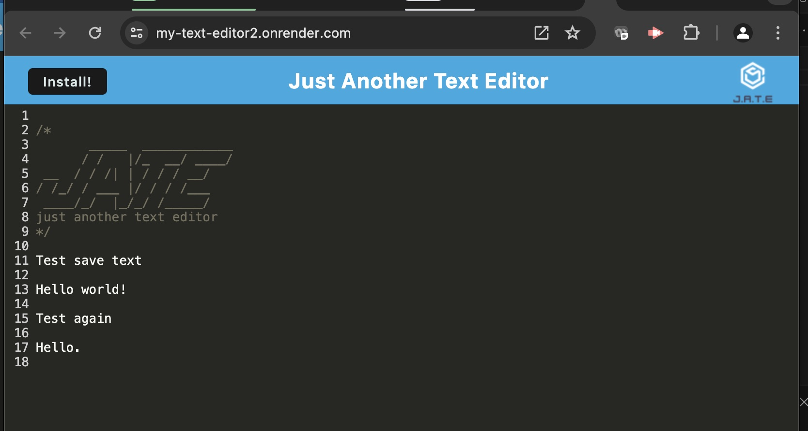

  # my-Text-Editor
  A text editor that runs in the browser

  # Description
  AS A developer
  I WANT to create notes or code snippets with or without an internet connection
  SO THAT I can reliably retrieve them for later use
  
  ## Table of Contents

  [Description](#description) | [License](#license) | [Questions](#questions)

  JATE

  

  JATE - saves text 

  

  JATE - Install, runs outside of browser

  

  JATE - Shows recorded text in browser

  

  ## License
  
  License: MIT

  
  
  ## Questions

  Deply: https://my-text-editor2.onrender.com/

  GitHub username: mbrown50

  GitHub Repo: https://github.com/mbrown50/my-Text-Editor